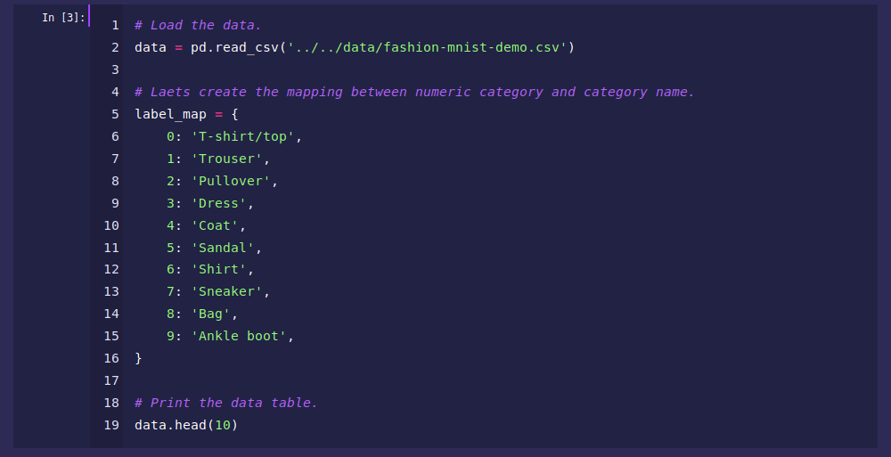

	

<h1 align="center">Shades of Purple Theme for Jupyter Notebook</h1>

 

 > Professional Jupyter Notebook theme with hand-picked & bold 🦄 shades of purple to go along with your terminal.
 

## Easy Installation

1. `pip install jupyterthemes`
2. `pip install --upgrade jupyterthemes`
3.  Copy `shades-of-purple.less` to `usr/local/lib/python3.6/dist-packages/jupyterthemes/styles/`
4.  Open `jt -t shades-of-purple` 

— Done!!! 🙌

	

	

 

## Put `Shades of Purple` In Other Places!

https://github.com/ahmadawais has built other `Shades of Purple` themes for different software. Here's a list.

* 💜 [VSCode theme](https://github.com/ahmadawais/shades-of-purple-vscode) — Shades of Purple
* 💜 [iTerm2 theme](https://github.com/ahmadawais/shades-of-purple-iterm2) — Shades of Purple
* 💜 [Hyper™ theme](https://github.com/ahmadawais/shades-of-purple-hyper) — Shades of Purple
* 💜 [Konsole theme](https://github.com/ahmadawais/shades-of-purple-konsole) — Shades of Purple
* 💜 [Slack theme](https://github.com/ahmadawais/shades-of-purple-slack) — Shades of Purple
* 💜 [Alfred theme](https://github.com/ahmadawais/shades-of-purple-alfred) — Shades of Purple
